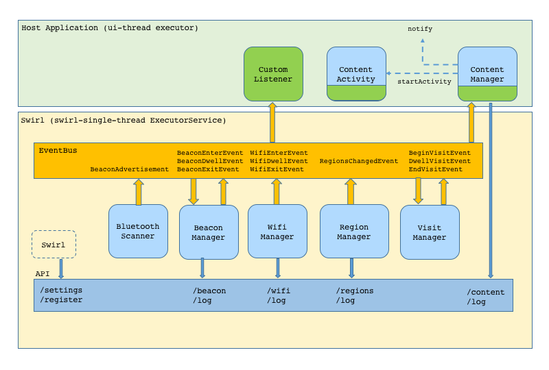
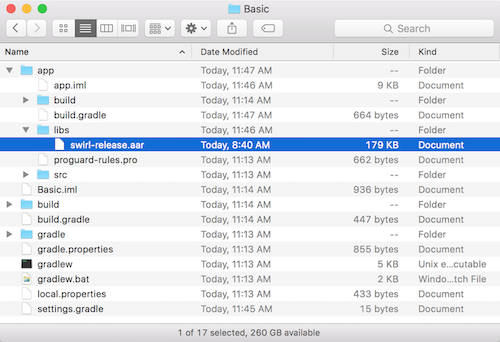

# Swirl Proximity Developer Guide
The Swirl platform is designed as a complete proximity platform detecting a variety of proximity signals like geofence, wifi and beacons and managing presence tracking, notification and content delivery.  The Swirl SDK is a component of this system which enables signal detection on mobile devices.

## Contents
- [Understanding Swirl](#understanding-swirl)
  - [Concepts and Objects](#concepts-and-objects)
- [Technical Overview](#technical-overview)
  - [Architechture](#architecture)
- [Integration](#integration)
  - [Get Application Key](#get-application-key)
  - [Verify Tools and Targets](#verify-tools-and-targets)
  - [Add Library to your Application](#add-library-to-your-application)
  - [Understanding and Modifying AndroidManifest.xml](#understanding-and-modifying-androidmanifestxml)
  - [Make Code Changes](#make-code-changes)
  - [Using Nearby with Swirl](#using-nearby-with-swirl)
  - [Oracle Responsys Mobile SDK Integration](#oracle-responsys-mobile-sdk-integration)

## Understanding Swirl


### Concepts and Objects
The Swirl platform and SDK use some key objects that are useful to define here.

**Location**: a physical street, city, state address - typically a brick-and-mortar store or venue. Locations are created and managed centrally in the Console and form the core building blocks of the platform.

**Placement**: a logical and business-friendly name given to a specific area inside a location.  For example - cosmetics, electronics department, checkout, neighborhood, parking lot, etc. Placements define the desired level of audience targeting and analytics/data collection marketers wish to achieve based on their defined marketing objectives. 

**BeaconAdvertisement**: an object which represents a single advertisement of a BLE beacon.  It contains a normalized identifier, an RSSI (signal strength) and a timestamp.  It can also contain extra information for protocols (like Eddystone) that broadcast such additional information.

**Beacon**:  an object which represents a BLE beacon.  It aggregates a stream of **BeaconAdvertisements** into a coherent object along with any server-side attributes assigned to the beacon, provided the current application has access rights to the signal.  Server-side attributes include **Location**, **Placement**, and any labels and custom-attributes assigned through the platform.

**Region**: an object representing a Geofence.  It has a GPS coordinate and a radius, or a set of points which represent a non-circular border.  Like a beacon, it also aggregates server side information like **Location**, **Placement** and any labels and custom-attributes assgned through the platform.

**WifiInfo**: an object that represents the current access point the mobile device is connected to.  It contains the BSSID, the SSID and an RSSI (if present).  Like other objects in the system, it can be associated with server-side objects like **Location**, **Placement**, and custom attributes.

**Visit**: an object which represents a higher-level of presence event.  All lower-level (Region, Beacon, Wifi) presence events are aggregated into a logical Visit event.  Visit objects contain **Location**, and **Placement** information as well as tracking location and placement dwell time and total elapsed time.  

**Content**: an object which represents targeted content selected by the platform in response to a presence event trigger (entry, dwell threshold exceeded, etc).  Content is generally a bundle containing metadata to create a notification and either a deep-link URL, an HTML creative URL or a JSON bag of custom attributes.
### User Privacy and Permissions
Earier versions of the Swirl SDK enforced a strict user opt-in policy which often complicated the host application's own attempts at user on-boarding and opt-in flows.  As a result, the current SDK has eliminated all notions of user status and state from the SDK and relies completely on the host-application to follow best practices in this area.  This SDK tracks location and should not be used unless the user has explicitly granted the application such rights.  For the most part, the OS helps enforce this best practice, but it is not universally the case and what the OS enforces varies by platform.  On Android, location permissions must be granted in order to use BLE beacons, on iOS this is not the case.  The host application is responsible for requesting the appropriate permissions and the SDK will try to run within those constraints to the best of its ability.

## Technical Overview 
### Architecture
The architecture of the Swirl SDK is similar on all platforms.  The Swirl object acts as a shell which establishes a working queue or thread, a common message bus and loads various managers into that enviorment.  The SDK glues together signal detection code that interacts with OS apis for detecting beacon, wifi and geofence signals with code that interacts with the swirl REST APIs to determine logical metadata like location, placement and other custom metadata.  In addition, the SDK tracks and accumulates dwell and can manage interaction with the platform to request and display targeted content.



#### Key components
The following is a list of the key components of the SDK and a brief description of each.  Most of these components are internal to the SDK but their description here is provided to help understand the operaiton of the SDK.  It is important to note that developers can extend the operation of the Swirl SDK by adding their own managers to the internal message bus and participate fully in its operation.
* **Swirl**:  The external wrapper for the API.  All public interfaces live here.  The ability to add delegates/listeners to the bus, post messages to components, set options, start and stop the SDK.  Establishes the private thread/queue, the message bus and loads all managers.
* **EventBus**:  The internal message bus.  Implementation varies by platform, but ensure that components can message each other in a way that ensures thread safety.  Managers can subscribe to messages, post messages or both.  On Android the implementation is a lightweight @Subscribe message delivery mechanism that ensures messages are dispatch using the correct Executor.
* **BluetoothScanner**:  A component which interact with the BluetoothManager apis for bluetooth or beacon detection and which publish normalized **BeaconAdvertisement** objects on to the bus.
* **BeaconManager**:  A component which subscribes to **BeaconAdvertisement** messages and aggregates those advertisements into a **Beacon** object.  It uses the API to resolve beacons (or not) and to fetch assoicated logical location and placement information and metadata.  It monitors beacons for proximity and manages enter, exit and closest detection.  It posts BeaconEnter, BeaconExit, BeaconDwell, BeacionNearest messages onto the bus.
* **RegionManager**:  A component which manages a working set of **Region** objects (retreived using the API) that are 'near' the users location.  These regions represent both geofences and 'control' regions.  Geofences have logical location, placement and other metadata associated.  Control regions are used internally by the SDK to control other signal detection, like when to start and stop scanning for beacons or what iBeacon UUIDs are nearby.  This component either starts its own os specific location manager or depends upon the host app to post location information onto the bus.  It generates RegionEnter/RegionExit events onto the bus.
* **WifiManager**: A component which integrates with the OS interfaces for detecting current connected wifi information and tracks changes to the connection state.  It coordinates through the API with the Swirl platform to get assoicated logical location informationa and associated metadata. It posts WifiEnter, WifiExit, WifiDwell events onto the message bus and creates **WifiInfo** objects.
* **NearbyManager**:  A component which integrates the Nearby APIs to scan for beacons registered using the google beacon platform. The Nearby APIs return messages attached to beacons with many types.  The NearbyManager automatically handles beacon attachments, processing some internally and returning others to the application.
* **VisitManager**:  A component which consumes the various Enter/Exit/Dwell events from the signal detectors and tracks enter and exit times, accumulates dwell and elapsed times by location and placement, and generates logical **Visit** objects and events for BeginVisit,DwellVisit, and EndVisit.
* **ContentManager**: A component which consumes **Visit** objects and events and requests content through the API.  If content is returned, then depending upon application state and SDK settings, it is responsible for displaying OS notifications and launching a content view or an application deep link.  This component is not part of the default set of managers that are loaded and users who want content services will add this object or a subclass of this object to the bus at startup.
* **API**:  A singleton which wraps the REST API to the Swirl platform.  All communications with the server are secure using https and all APIs must be authenticated using the API Key assigned through the Swirl platform.  
* **Settings**: A singleton which provides property value and object storage in a local, encrypted store.  All constants in the system are reflected through this object with local, server, and default values.  Values can be pushed from the server to change the behavior of the system at runtime.

## Integration
### Get Application Key
Log in to the Swirl console using supported browser (Chrome or Safari) and using credentials you have received from your Swirl representative or Swirl administrator.
 1. Navigate to the Apps tab in the portal
 2. Create a new application.
 3. This process will generate an Application Key. This value will be needed to passed to the SDK at start.

### Verify Tools and Targets
The Swirl SDK is compatible with Android versions 5.0 (API level 21) and above.  
The Swirl SDK has the following dependecies:
	'com.google.android.gms:play-services-auth:9+'
	'com.google.android.gms:play-services-nearby:9+'
	
### Add Library to your Application


#### Adding the Library Manually
 1. Copy the Swirl AAR into **&lt;Project&gt;/app/libs**

 
 
 2. Edit the *Module* `build.gradle`
 3. Add a repository for the libs directory
    ```gradle
    repositories {
        flatDir {
            dirs 'libs'
        }
    }
    ```

 4. Add a line in `dependencies` to compile the Swirl AAR
    ```gradle
    dependencies {
        compile(name: 'swirl-release', ext: 'aar')
        ...
    }
    ```
 5. Click **"Sync Now"** in the upper right to apply the changes

#### Adding the Library using Maven or JCenter
 1. Edit the *Module* `build.gradle`
 2. Add a line in `repositories` to support either Maven or JCenter
	```gradle
	repositories {
		mavenCentral()
	}
	```
	
	```gradle
	repositories {
		jcenter()
	}
	```	
	
 3. Add a line in `dependencies` to compile the Swirl AAR
	```gradle
    compile 'com.swirl:swirl-sdk-android:<version>'
    ```
	i.e.
	```gradle
    dependencies {
        compile 'com.swirl:swirl-sdk-android:3.3'
        ...
    }
    ```
	
 4. Click **"Sync Now"** in the upper right to apply the changes

### Understanding and Modifying AndroidManifest.xml
Curently, most of the manifest changes are not included in the libraries AndroidManifest.xml and you are required to add the necessary permissions and registrations to the application AndroidManifest.xml.  This is currently done on purpose to give more control to the application developer with regards to what features to enable, etc.

#### Permissions
There are static and dynamic permissions required to enable the Swirl library to function properly.  Below is the basic set of static permissions required to use Swirl.  Certain permissions in here are optional on the whole, but required for certain features.  For example, ACCESS_WIFI_STATE is required for using Wifi access points as signals for the platform.

There are additional changes that are required for Android 6.0 but those need to be made in code and are mentioned below.

```xml
 <uses-permission android:name="android.permission.INTERNET" />                  <!-- Required for internet -->
 <uses-permission android:name="android.permission.ACCESS_NETWORK_STATE" />      <!-- Required to check connectivity -->
 <uses-permission android:name="android.permission.ACCESS_WIFI_STATE"/>
 <uses-permission android:name="android.permission.BLUETOOTH"/>                  <!-- Required for BLE -->
 <uses-permission android:name="android.permission.BLUETOOTH_ADMIN"/>            <!-- Required for BLE -->
 <uses-permission android:name="android.permission.RECEIVE_BOOT_COMPLETED"/>     <!-- Required to start swirl on boot -->
 <uses-permission android:name="android.permission.ACCESS_COARSE_LOCATION" />    <!-- Required for location -->
 <uses-permission android:name="android.permission.ACCESS_FINE_LOCATION" />      <!-- Optional for occasional fine-location -->
```
#### Startup Options
There are several ways to pass startup options to the Swirl library.  You can do so when you call start by passing a Bundle of options in, or you can use the string representation of the option added to the application meta-data within the AndroidManifest.xml.  Note that all such keys are prefixed with `com.swirl`.  See below for an example using API_KEY.

```xml
 <application
     <meta-data android:name="com.swirl.api_key" android:value="YOU-CAN-PUT-YOUR-API-KEY-HERE"/>
     ...
```
#### Registering Components

In order for the library to function properly, a number of components need to be registered in the manifest.  
1. Swirl uses a service to run in the background.  This services is sticky and runs for a set period of time after being launched in response to some signal from the OS.  This service must be registered.
2. Several BroadcastReceivers also are employed to receive various inputs from the OS.  These receivers are used to catch Notification events (OPEN, DISMISS), Alarm Events, Location Events, and Device Change events (NETWORK, WIFI, etc).
3. ContentActivity.  If you are using the ContentManager to schedule targeted content against your signals (geofence, wifi, beacon), and you want want to display interstitial content, then you need to register the ContentActivity which is launched to display the web content.

```xml
<application
		android:name=".BaseApplication">
		
  <service  android:name="com.swirl.Swirl$Service"/>
  <receiver android:name="com.swirl.Swirl$Receiver"        android:enabled="true"/>
  <receiver android:name="com.swirl.Swirl$LocationChanged" android:enabled="true"/>
  <receiver android:name="com.swirl.Swirl$DeviceChanged"   android:enabled="true">
      <intent-filter>
          <action android:name="android.intent.action.BOOT_COMPLETED"/>
          <action android:name="android.net.wifi.STATE_CHANGE"/>
      </intent-filter>
  </receiver>
  <activity android:name="com.swirl.ContentActivity"/>
```

#### Proguard

If you are using Proguard to minimize your application, make sure you include the following lines in your proguard configuration file.
```
-keep public class com.swirl.*** { *; }
```
This will prevent the proguard process from removing needed symbols.

### Make Code Changes

#### Permission Changes
The Swirl SDK requires Location Services, Bluetooth and Local Notifications to be fully effective.  The host application is responsible for managing the opt-in flow and prompting the user for the necessary permissions.  When started, if the proper permissions have not been granted, then functionality will be limited.  To support Android 6.0, ff you do not already, you will need to request dynamic permissions for Location.

#### Background Launch Changes
Because there are a number of different ways that Swirl can be launched we recommend you subclass the Application and initialize Swirl there.  That way, no matter how the functionality is launched that initialization will be done first and Swirl will be ready and running when it needs to process the event that cause the launch.

#### Initialize, Configure and Start
A lot of time and effort has been put into making the Swirl SDK as simple as possible without sacrificing functionality or power.  Due to the possibility of background launches caused by LocationManager or AlarmManager or other broadcast Intents that the SDK has registered for, the best place to initialize and start the SDK is early in `onCreate` in your `Application` subclass.
```java
public class BaseApplication extends Application {
    @Override public void onCreate() {
        super.onCreate();
        
        Bundle options = new Bundle();
        // set any options you want to set at startup (or pass null)

        Swirl.getInstance(this).addListener(new ContentManager(this));
        Swirl.getInstance().start(options);
    }
}
```

### Using Nearby with Swirl

Swirl supports Nearby in a number of ways.  You can use Swirl to manage the registration of your beacons and attachments with Nearby and you can use the Swirl SDK to detect beacons and their attachments whether they were registered through Swirl's platform or not.  Beacons registered with the Swirl will be available for Swirl's targeted content delivery, but the SDK can detect and return any attachments on the beacon. 

#### Configure your project for Nearby
Since the NearbyManager uses the Nearby APIs from google, you will need to ensure that you have an API key allocated thorugh the Google API dashboard and specified in your Manifest.xml.

```xml		
		<meta-data
			android:name="com.google.android.nearby.messages.API_KEY"
			android:value="YOUR-GOOGLE-NEARBY-API-KEY-GOES-HERE"/>
```

#### Initialize and start the NearbyManager

The Swirl SDK can be used with Nearby by adding the NearbyManager to the set of active managers when starting the SDK.  The NearbyManager is not started by default, but can be added folloing the following examples:
```java
	// add default NearbyManager which scans for all project message types
	Swirl.getInstance().addListener(new NearbyManager(null));
	
	// or, configure a specific type or Eddystone-UID namespace
	Swirl.getInstance().addListener(new NearbyManager(null)
		.addEddystoneNamespace(""f86410c4c588a9cec5f2"));
```
Due to a design choice with the Nearby APIs, initiating message scanning (even for BLE only messages) requires an Activity context.  As a result, you must call the `setActivity` method on the NearbyManager to provide an appropriate context.  Without an appropriate context, Nearby will cease message detection.

```java
	// be sure to call this whenever the activity changes
	NearbyManager.getInstance().setActivity(this);
```
#### Getting Beacon Attachments

Nearby has a very flexible system for attaching data to beacons and the SDK will return those attachments when encountered through a callback on the `SwirlListener`:
```java
    /**
     * Call whenever the NearbyManager posts a nearby related message.
     * @param manager The NearbyManager
     * @param namespace The project or public attachment namespace
     * @param type The attachement type
     * @param content The byte array which is the message content
     * @param rssi The signal strength if available, or -1 if not available
     */
    protected void onNearbyMessage(NearbyManager manager, String namespace, 
    					String type, byte[] content, int rssi);
```
However, it is important to note that some attachments are treated specially by the system and will not be returned through the SDK directly. The following messages are not delivered by `onNearbyMessage` but are handled as specified.

|Message-Namespace|Message-Type|Default Action|
|-----------------|------------|--------------|
|`MESSAGE_NAMESPACE_RESERVED`|`MESSAGE_TYPE_EDDYSTONE_UID`|Message content are used to construct an Eddystone-UID `BeaconAdvertisement` object which is then handled as any other scanned BLE advertisement|
|**project-name**|`swirl`|Message contents are used to construct a `BeaconAdvertisement` object which is then handled appropriately by the system|

#### Try our example

The Swirlx example has all of the code you need to try the Nearby API integration ready to go.  All you need to do is search for Nearby in the `BaseApplication` and `MainActivity` java source and uncomment the lines that are commented out.  In addition, you should add the relevant API keys in the `AndroidManifest.xml` file.

### Oracle Responsys Mobile SDK Integration
In order to integrate the Oracle Responsys Mobile SDK (formerly Push IO) with the Swirl SDK you will need to include three key-value pairs in the Swirl SDK's User Info.
 1. "oapi_key" - (required) Provides the Oracle Responsys Mobile SDK API Key used by your app.
 2. "odevice_id" - (required) An identifier used by the Oracle Responsys Mobile SDK to identify a mobile device.
 3. "oid" - (optional*) Provides a unique identifier for a mobile device user that is linked in Responsys to a known user profile. An example of an "oid" identifier could be an email address or a customer ID for example.

\* In order to utilize Responsys Programs via Swirl-mapped Responsys custom events, “oid” is required. In the absence of "oid", Swirl will utilize the "odevice_id" for direct triggering of Responsys push campaigns.

These three values should be included in a JSONObject which is then set as the Swirl SDK's User Info. The following code snippet demonstrates a simple example of how to do this.

```java
JSONObject userInfo = new JSONObject();
userInfo.put("oapi_key", PushIOManager.getInstance(this).getAPIKey());
userInfo.put("odevice_id", PushIOManager.getInstance(this).getExternalDeviceTrackingID());
userInfo.put("oid", "<Identifier>");
Swirl.getInstance().setUserInfo(userInfo);
```

### KouponMedia Mobile SDK Integration
The Swirlx sample application includes source code for a custom content handler that integrates with Koupon Media's offer system.  The sample module gets an offerId attribute from the custom content creative and uses that id in API calls to Koupon Media's servers in order to add an offer for the user and to fetch attributes about that offer for the purpose of creating a contextual notification.  The sample code modifies the content with the notification and then allows the modified content to flow through the system.

To instantiate the `KouponMediaManager` you need the API Key, API Secret and User identifier for your KouponMedia account and you need to construct the object and add it as a delegate to Swirls multi-delegate event bus.

```java
  Swirl.getInstance(this).addListener(new KouponMediaListener(this, "KM-API-KEY",
                "KM-API-SECRET", "KM-USER-ID"));
```
You will also need to change the URLs in the KouponMediaListener source code as the ones in the sample code point to the KouponMedia sandbox environment:

```java
    private static String   KM_BASE_URL             = "https://consumer.sandbox1.kouponmedia.com/v2";
    private static String   KM_DEFAULT_VIEWER_URL   = "https://offer-sandbox1.kou.pn/OfferViewer/Redirect.aspx?property_code=swirl_mobilecapture&offers=%s";
```
Finally, by default the sample code pops a mobile browser window that points to the default KouponMedia mobile offier viewer.  If you have tightly integrated the KM sdk and fuctionality into your application and have an offer inbox that you want to direct the user to when they encounter a Swirl placement tied to an offer or interact with a notification generated by such an encounter, then you will need to set the property `offerViewerURL` to a custom URL scheme/intent that can direct the user to that inbox.

