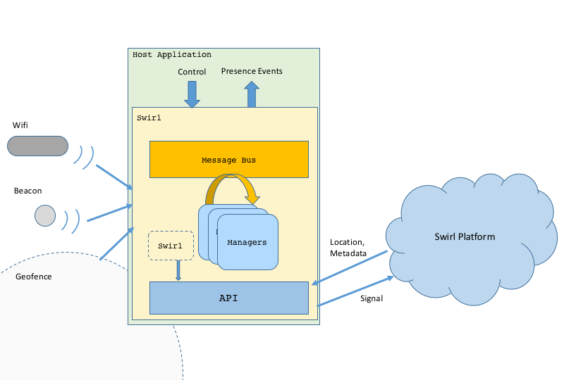

# Swirl Proximity Developer Guide
The Swirl platform is designed as a complete proximity platform detecting a variety of proximity signals like geofence, wifi and beacons and managing presence tracking, notification and content delivery.  The Swirl SDK is a component of this system which enables signal detection on mobile devices.

## Contents
- [Understanding Swirl](#understanding-swirl)
  - [Concepts and Objects](#concepts-and-objects)
- [Technical Overview](#technical-overview)
  - [Architechture](#architecture)
- [Integration](#integration)
  - [Application Key](#get-application-key)
  - [Verify Tools and Targets](#verify-tools-and-targets)
  - [Add Framework to your Application](#add-library-to-your-application)
  - [Understanding and Modifying AndroidManifest.xml](#understanding-and-modifying-androidmanifestxml)
  - [Make Code Changes](#make-code-changes)

## Understanding Swirl


### Concepts and Objects
The Swirl platform and SDK use some key objects that are useful to define here.

**Location**: a physical street, city, state address - typically a brick-and-mortar store or venue. Locations are created and managed centrally in the Console and form the core building blocks of the platform.

**Placement**: a logical and business-friendly name given to a specific area inside a location.  For example - cosmetics, electronics department, checkout, neighborhood, parking lot, etc. Placements define the desired level of audience targeting and analytics/data collection marketers wish to achieve based on their defined marketing objectives. 

**BeaconAdvertisement**: an object which represents a single advertisement of a BLE beacon.  It contains a normalized identifier, an RSSI (signal strength) and a timestamp.  It can also contain extra information for protocols (like Eddystone) that broadcast such additional information.

**Beacon**:  an object which represents a BLE beacon.  It aggregates a stream of **BeaconAdvertisements** into a coherent object along with any server-side attributes assigned to the beacon, provided the current application has access rights to the signal.  Server-side attributes include **Location**, **Placement**, and any labels and custom-attributes assigned through the platform.

**Region**: an object representing a Geofence.  It has a GPS coordinate and a radius, or a set of points which represent a non-circular border.  Like a beacon, it also aggregates server side information like **Location**, **Placement** and any labels and custom-attributes assgned through the platform.

**WifiInfo**: an object that represents the current access point the mobile device is connected to.  It contains the BSSID, the SSID and an RSSI (if present).  Like other objects in the system, it can be associated with server-side objects like **Location**, **Placement**, and custom attributes.

**Visit**: an object which represents a higher-level of presence event.  All lower-level (Region, Beacon, Wifi) presence events are aggregated into a logical Visit event.  Visit objects contain **Location**, and **Placement** information as well as tracking location and placement dwell time and total elapsed time.  

**Content**: an object which represents targeted content selected by the platform in response to a presence event trigger (entry, dwell threshold exceeded, etc).  Content is generally a bundle containing metadata to create a notification and either a deep-link URL, an HTML creative URL or a JSON bag of custom attributes.
### User Privacy and Permissions
Earier versions of the Swirl SDK enforced a strict user opt-in policy which often complicated the host application's own attempts at user on-boarding and opt-in flows.  As a result, the current SDK has eliminated all notions of user status and state from the SDK and relies completely on the host-application to follow best practices in this area.  This SDK tracks location and should not be used unless the user has explicitly granted the application such rights.  For the most part, the OS helps enforce this best practice, but it is not universally the case and what the OS enforces varies by platform.  On Android, location permissions must be granted in order to use BLE beacons, on iOS this is not the case.  The host application is responsible for requesting the appropriate permissions and the SDK will try to run within those constraints to the best of its ability.

## Technical Overview 
### Architecture
The architecture of the Swirl SDK is similar on all platforms.  The Swirl object acts as a shell which establishes a working queue or thread, a common message bus and loads various managers into that enviorment.  The SDK glues together signal detection code that interacts with OS apis for detecting beacon, wifi and geofence signals with code that interacts with the swirl REST APIs to determine logical metadata like location, placement and other custom metadata.  In addition, the SDK tracks and accumulates dwell and can manage interaction with the platform to request and display targeted content.


#### Key components
The following is a list of the key components of the SDK and a brief description of each.  Most of these components are internal to the SDK but their description here is provided to help understand the operaiton of the SDK.  It is important to note that developers can extend the operation of the Swirl SDK by adding their own managers to the internal message bus and participate fully in its operation.
* **Swirl**:  The external wrapper for the API.  All public interfaces live here.  The ability to add delegates/listeners to the bus, post messages to components, set options, start and stop the SDK.  Establishes the private thread/queue, the message bus and loads all managers.
* **EventBus**:  The internal message bus.  Implementation varies by platform, but ensure that components can message each other in a way that ensures thread safety.  Managers can subscribe to messages, post messages or both.  On Android the implementation is a lightweight @Subscribe message delivery mechanism that ensures messages are dispatch using the correct Executor.
* **BluetoothScanner**:  A component which interact with the BluetoothManager apis for bluetooth or beacon detection and which publish normalized **BeaconAdvertisement** objects on to the bus.
* **BeaconManager**:  A component which subscribes to **BeaconAdvertisement** messages and aggregates those advertisements into a **Beacon** object.  It uses the API to resolve beacons (or not) and to fetch assoicated logical location and placement information and metadata.  It monitors beacons for proximity and manages enter, exit and closest detection.  It posts BeaconEnter, BeaconExit, BeaconDwell, BeacionNearest messages onto the bus.
* **RegionManager**:  A component which manages a working set of **Region** objects (retreived using the API) that are 'near' the users location.  These regions represent both geofences and 'control' regions.  Geofences have logical location, placement and other metadata associated.  Control regions are used internally by the SDK to control other signal detection, like when to start and stop scanning for beacons or what iBeacon UUIDs are nearby.  This component either starts its own os specific location manager or depends upon the host app to post location information onto the bus.  It generates RegionEnter/RegionExit events onto the bus.
* **WifiManager**: A component which integrates with the OS interfaces for detecting current connected wifi information and tracks changes to the connection state.  It coordinates through the API with the Swirl platform to get assoicated logical location informationa and associated metadata. It posts WifiEnter, WifiExit, WifiDwell events onto the message bus and creates **WifiInfo** objects.
* **VisitManager**:  A component which consumes the various Enter/Exit/Dwell events from the signal detectors and tracks enter and exit times, accumulates dwell and elapsed times by location and placement, and generates logical **Visit** objects and events for BeginVisit,DwellVisit, and EndVisit.
* **ContentManager**: A component which consumes **Visit** objects and events and requests content through the API.  If content is returned, then depending upon application state and SDK settings, it is responsible for displaying OS notifications and launching a content view or an application deep link.  This component is not part of the default set of managers that are loaded and users who want content services will add this object or a subclass of this object to the bus at startup.
* **API**:  A singleton which wraps the REST API to the Swirl platform.  All communications with the server are secure using https and all APIs must be authenticated using the API Key assigned through the Swirl platform.  
* **Settings**: A singleton which provides property value and object storage in a local, encrypted store.  All constants in the system are reflected through this object with local, server, and default values.  Values can be pushed from the server to change the behavior of the system at runtime.

## Integration
### Get Application Key
Log in to the Swirl console using supported browser (Chrome or Safari) and using credentials you have received from your Swirl representative or Swirl administrator.
 1. Navigate to the Apps tab in the portal
 2. Create a new application.
 3. This process will generate an Application Key. This value will be needed to passed to the SDK at start.

### Verify Tools and Targets
The Swirl SDK is compatible with Android versions 5.0 (API level 21) and above. 

### Add Library to your Application


#### Adding the Library Manually
 1. Copy the Swirl AAR into **&lt;Project&gt;/app/libs**

 
 
 2. Edit `build.gradle (Module: app)`
 3. Add a repository for the libs directory
    ```gradle
    repositories {
        flatDir {
            dirs 'libs'
        }
    }
    ```

 4. Add a line in `dependencies` to compile the Swirl AAR
    ```gradle
    dependencies {
        compile(name: 'swirl-release', ext: 'aar')
        ...
    }
    ```
 5. Click **"Sync Now"** in the upper right to apply the changes

#### Adding the Library using Maven
  1. *Coming soon*

### Understanding and Modifying AndroidManifest.xml

#### Permissions
```xml
 <uses-permission android:name="android.permission.INTERNET" />                  <!-- Required for internet -->
 <uses-permission android:name="android.permission.ACCESS_NETWORK_STATE" />      <!-- Required to check connectivity -->
 <uses-permission android:name="android.permission.ACCESS_WIFI_STATE"/>
 <uses-permission android:name="android.permission.BLUETOOTH"/>                  <!-- Required for BLE -->
 <uses-permission android:name="android.permission.BLUETOOTH_ADMIN"/>            <!-- Required for BLE -->
 <uses-permission android:name="android.permission.RECEIVE_BOOT_COMPLETED"/>     <!-- Required to start swirl on boot -->
 <uses-permission android:name="android.permission.ACCESS_COARSE_LOCATION" />    <!-- Required for location -->
 <uses-permission android:name="android.permission.ACCESS_FINE_LOCATION" />      <!-- Optional for occasional fine-location -->
```
#### Startup Options
```xml
 <application
     <meta-data android:name="com.swirl.api_key" android:value="YOU-CAN-PUT-YOUR-API-KEY-HERE"/>
     ...
```
#### Registering Components
```xml
<application
		android:name=".BaseApplication">
		
  <service  android:name="com.swirl.Swirl$Service"/>
  <receiver android:name="com.swirl.Swirl$Receiver"        android:enabled="true"/>
  <receiver android:name="com.swirl.Swirl$LocationChanged" android:enabled="true"/>
  <receiver android:name="com.swirl.Swirl$DeviceChanged"   android:enabled="true">
      <intent-filter>
          <action android:name="android.intent.action.BOOT_COMPLETED"/>
          <action android:name="android.net.wifi.STATE_CHANGE"/>
      </intent-filter>
  </receiver>
  <activity android:name="com.swirl.ContentActivity"/>
```

### Make Code Changes

#### Permission Changes
The Swirl SDK requires Location Services, Bluetooth and Local Notifications to be fully effective.  The host application is responsible for managing the opt-in flow and prompting the user for the necessary permissions.  When started, if the proper permissions have not been granted, then functionality will be limited.  

**android 6.0** DYNAMIC PERMISSIONS
If you do not already, you will need to request authorization using `requestAlwausAuthorization` or `requestWhenInUseAuthorization` on an instance of `CLLocationManager`.  You will also need to request the appropriate level of notification permissions using `registerUserNotificationSettings` on `UIApplication`.  Examples of how to do this are included in our sample application.

#### Background Launch Changes
subclass MainApplication notes why do this....

#### Initialize, Configure and Start
A lot of time and effort has been put into making the Swirl SDK as simple as possible without sacrificing functionality or power.  Due to the possibility of background launches caused by CoreLocation or CoreBluetooth services that the SDK starts, the best place to initialize and start the SDK is early in `application:didFinishLaunchingWithOptions:`
```java
public class BaseApplication extends Application {
    @Override public void onCreate() {
        super.onCreate();
        
        Bundle options = new Bundle();
        // set any options you want to set at startup (or pass null)

        Swirl.getInstance(this).addListener(new ContentManager(this));
        Swirl.getInstance().start(options);
    }
}
```
